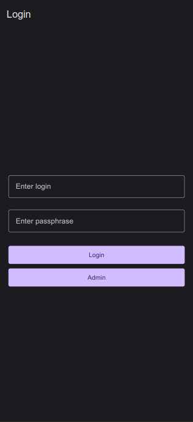
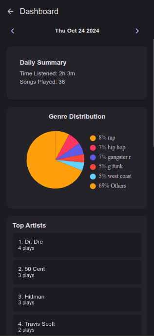
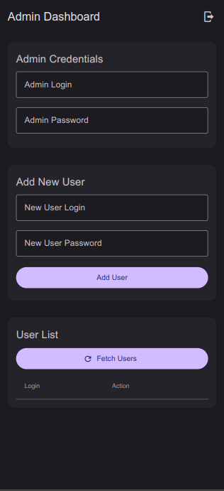

# Track My Tracks - Frontend

**Track My Tracks** is the web-based frontend for tracking your Spotify listening habits. This application provides a detailed overview of your listening history and behavior, offering rich visualizations and insights into your Spotify usage, including total listening time, favorite genres, and top artists. Built using modern web technologies, it ensures an engaging user experience across devices.


## Screenshots

- **Login Page**:
  

- **Home Page**:
  

- **Admin Page**:
  

## Key Features

- **Intuitive User Interface**: Designed with Expo React Native to offer a seamless, cross-platform user experience.
- **Listening History**: Dive deep into a list of all the tracks you’ve played on Spotify, along with timestamps and detailed metadata.
- **Total Listening Time**: Get a complete breakdown of your total listening time over various periods.
- **Top Genres & Artists**: Analyze your musical preferences with detailed genre and artist insights.

## Tech Stack

- **Expo React Native**: A powerful, cross-platform framework that ensures the app runs smoothly on web, mobile, and desktop.
- **TypeScript**: Adds static typing for increased reliability and productivity during development.
- **Backend API**: The app connects seamlessly to the backend API ([Track My Tracks Backend](https://github.com/FlorealRISSO/track-my-tracks-backend)) to retrieve real-time Spotify listening data.

## Getting Started

### Prerequisites

Make sure you have the following installed:

- **Node.js** and **npm**: Ensure both are installed before you start. You can verify by running the following commands:
   ```bash
   node -v
   npm -v
   ```

### Installation

1. **Clone the repository**:
   ```bash
   git clone https://github.com/yourusername/track-my-tracks-frontend.git
   cd track-my-tracks-frontend
   ```

2. **Install the required dependencies**:
   ```bash
   npm install
   ```

3. **Set up Environment Variable**:  
   Create a `.env` file in the root directory with the following content:

   ```bash
   BACKEND_URL=your_backend_url_here
   ```

   Replace `your_backend_url_here` with the actual URL of your backend API.

4. **Run the app**:
   To start the web application in development mode, use the following command:
   ```bash
   npx expo start
   ```

   This will start the development server and automatically open the app in your default browser.

## Usage

- After launching the app, log in with your Spotify account to visualize your listening history.
- Navigate through different sections like your listening history, total listening time, and insights on your favorite genres and top artists.

## Related Projects

- **Backend**: The backend for this project can be found [here](https://github.com/FlorealRISSO/track-my-tracks-backend), which handles data collection and processing.

## License

This project is licensed under the MIT License. See the [LICENSE](./LICENSE) file for details.
