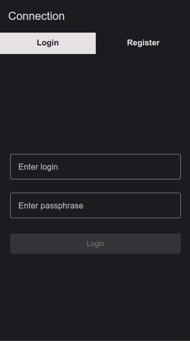
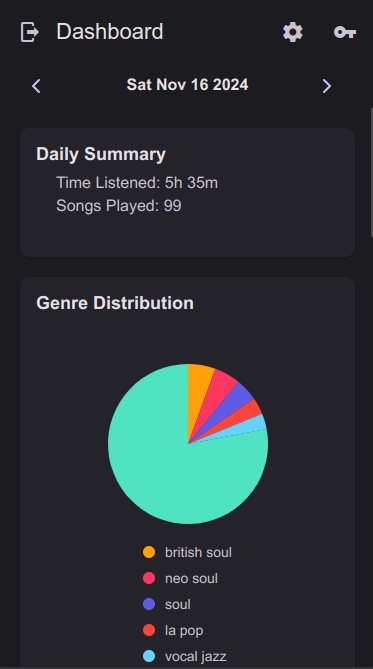

# Track My Tracks - Frontend

**Track My Tracks** is the web-based frontend for tracking your Spotify listening habits. This application provides a detailed overview of your listening history and behavior, offering rich visualizations and insights into your Spotify usage, including total listening time, favorite genres, and top artists. Built using modern web technologies, it ensures an engaging user experience across devices.

## Docker Setup

To build and run the application with Docker, refer to the instructions in the [Track My Tracks - Main Repository](https://github.com/FlorealRISSO/track-my-tracks) for the full setup and configuration.

## Repositories

- **Main**: [Track My Tracks - Main Repository](https://github.com/FlorealRISSO/track-my-tracks)
- **Frontend**: [Track My Tracks - Frontend GitHub Repository](https://github.com/FlorealRISSO/track-my-tracks)
- **Backend**: [Track My Tracks - Backend GitHub Repository](https://github.com/FlorealRISSO/track-my-tracks-backend)

## Screenshots

- **Login Page**:

  

- **Home Page**:

  

- **Admin Page**:

  

- **Admin Page (Second View)**:

  

- **Settings Page**:

  

## Key Features

- **Intuitive User Interface**: Designed with Expo React Native to offer a seamless, cross-platform user experience.
- **Listening History**: Dive deep into a list of all the tracks you’ve played on Spotify, along with timestamps and detailed metadata.
- **Total Listening Time**: Get a complete breakdown of your total listening time over various periods.
- **Top Genres & Artists**: Analyze your musical preferences with detailed genre and artist insights.

## Tech Stack

- **Expo React Native**: A powerful, cross-platform framework that ensures the app runs smoothly on web, mobile, and desktop.
- **TypeScript**: Adds static typing for increased reliability and productivity during development.
- **Backend API**: The app connects seamlessly to the backend API ([Track My Tracks Backend](https://github.com/FlorealRISSO/track-my-tracks-backend)) to retrieve real-time Spotify listening data.

## Usage

- Once the app is running, log in with your Spotify account to visualize your listening history.
- Navigate through different sections like your listening history, total listening time, and insights on your favorite genres and top artists.

## License

This project is licensed under the MIT License. See the [LICENSE](./LICENSE) file for details.
